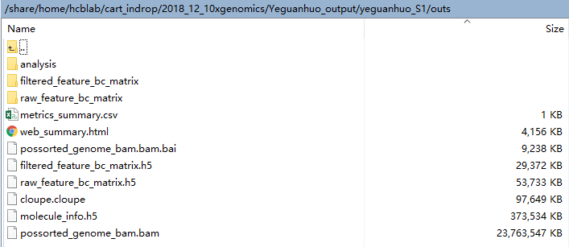

# sample FCM figure
```
# 浆细胞白血病 CAR-T Plasma cell leukemia patient,six samples
library(ggplot2)
library(grid)
library(dplyr)
library(reshape2)
setwd("g:/work/2018_01/cart_singleCellInDrop-seq/clinicalAndSampleInfo/from_lixia/")
ygh <- read.csv("ygh_summary.txt",head=T,sep="\t")
ygh <- ygh[-c(1,16),]
#ygh$lymphoc_CD3_absoluteValue <- ygh$lymphocytes1*ygh$CD45*ygh$CD3*0.000001
#ygh$CD3_CARnegCD8 <- ygh$CARneg * ygh$CARnegCD8 * 0.0001
#ygh$CD3_CARnegCD4 <- ygh$CARneg * ygh$CARnegCD4 * 0.0001
#ygh$CD3_CARnegDN <- ygh$CARneg * (100 - (ygh$CARnegCD8 + ygh$CARnegCD4)) * 0.0001
#ygh$CD3_CARposCD8 <- ygh$CARpos * ygh$CARposCD8 * 0.0001
#ygh$CD3_CARposCD4 <- ygh$CARpos * ygh$CARposCD4 * 0.0001
#ygh$CD3_CARposDN <- ygh$CARpos * (100 - (ygh$CARposCD8 + ygh$CARposCD4)) * 0.0001
#ygh$CD3_other <- 100 - (ygh$CARneg + ygh$CARpos)
#ygh_long_CD3 <- melt(data=ygh[,c(3,16:18)], id.vars="days_CART_after_num")
#ygh_long_CD3_detail <- melt(data=ygh[,c(3,19:24)], id.vars="days_CART_after_num")
ygh$lymphoc_CD3neg_absoluteValue <- ygh$lymphocytes1*(1-ygh$CD45*ygh$CD3*0.0001)*0.01
ygh$PBMC_nonlymphoc <- (1-ygh$lymphocytes1*0.01)
ygh$lymphoc_CD3_CARneg <- ygh$lymphocytes1*ygh$CD45*ygh$CD3*ygh$CARneg*10^-8
ygh$lymphoc_CD3_CARpos <- ygh$lymphocytes1*ygh$CD45*ygh$CD3*ygh$CARpos*10^-8
ygh$CD3_CARnegCD8 <- ygh$CARnegCD8 * 0.01
ygh$CD3_CARnegCD4 <- ygh$CARnegCD4 * 0.01
ygh$CD3_CARnegDN <- (100 - (ygh$CARnegCD8 + ygh$CARnegCD4)) * 0.01
ygh$CD3_CARposCD8 <- ygh$CARposCD8 * 0.01
ygh$CD3_CARposCD4 <- ygh$CARposCD4 * 0.01
ygh$CD3_CAposDN <- (100 - (ygh$CARposCD8 + ygh$CARposCD4)) * 0.01

ygh_long_CD3 <- melt(data=ygh[,c(3,16:19)], id.vars="days_CART_after_num")
ygh_long_CARneg <- melt(data=ygh[,c(3,20:22)], id.vars="days_CART_after_num")
ygh_long_CARpos <- melt(data=ygh[,c(3,23:25)], id.vars="days_CART_after_num")

p1_CD3 <- ggplot(ygh_long_CD3,aes(x=days_CART_after_num,y=value,fill=variable)) + geom_area()
p2_CARneg <- ggplot(ygh_long_CARneg,aes(x=days_CART_after_num,y=value,fill=variable)) + geom_area()
p3_CARpos <- ggplot(ygh_long_CARpos,aes(x=days_CART_after_num,y=value,fill=variable)) + geom_area()
p1 <- p1_CD3 +
    scale_fill_manual(values=c("#67a9cf","#f7f7f7","#b2182b","#ef8a62")) +
    scale_x_continuous(breaks=1:15) +
    xlab("Days after CAR-T infusion") +
    ylab("% in PBMC") +
    #theme(axis.text.x = element_text(angle = 90, vjust = 0.5)) +
    #scale_fill_brewer(palette = "Dark2") +
    geom_vline(aes(xintercept=c(8)), color="#252525", linetype="dashed", size=0.8) +
    geom_vline(aes(xintercept=c(15)), color="#252525", linetype="dashed", size=0.8) +
    geom_vline(aes(xintercept=c(2)), color="#878787", linetype="dashed", size=0.5) +
    geom_vline(aes(xintercept=c(4)), color="#878787", linetype="dashed", size=0.5) +
    geom_vline(aes(xintercept=c(7)), color="#878787", linetype="dashed", size=0.5) +
    geom_vline(aes(xintercept=c(9)), color="#878787", linetype="dashed", size=0.5) +
    geom_vline(aes(xintercept=c(12)), color="#878787", linetype="dashed", size=0.5) +
    theme_classic() +
    theme(axis.line.x=element_blank(),
          axis.text.x=element_blank(),
          axis.ticks.x=element_blank(),
          axis.title.x=element_blank(),
          panel.grid.minor.x=element_blank(),
          panel.grid.major.x=element_blank())


p2 <- p2_CARneg +
    scale_fill_manual(values=c("#f4a582","#bababa","#404040")) +
    scale_x_continuous(breaks=1:15) +
    xlab("Days after CAR-T infusion") +
    ylab("% in CAR-") +
    #theme(axis.text.x = element_text(angle = 90, vjust = 0.5)) +
    #scale_fill_brewer(palette = "Dark2") +
    geom_vline(aes(xintercept=c(8)), color="#252525", linetype="dashed", size=0.8) +
    geom_vline(aes(xintercept=c(15)), color="#252525", linetype="dashed", size=0.8) +
    geom_vline(aes(xintercept=c(2)), color="#878787", linetype="dashed", size=0.5) +
    geom_vline(aes(xintercept=c(4)), color="#878787", linetype="dashed", size=0.5) +
    geom_vline(aes(xintercept=c(7)), color="#878787", linetype="dashed", size=0.5) +
    geom_vline(aes(xintercept=c(9)), color="#878787", linetype="dashed", size=0.5) +
    geom_vline(aes(xintercept=c(12)), color="#878787", linetype="dashed", size=0.5) +
    theme_classic() +
    theme(axis.line.x=element_blank(),
          axis.text.x=element_blank(),
          axis.ticks.x=element_blank(),
          axis.title.x=element_blank(),
          panel.grid.minor.x=element_blank(),
          panel.grid.major.x=element_blank())

p3 <- p3_CARpos +
    scale_fill_manual(values=c("#f4a582","#bababa","#404040")) +
    scale_x_continuous(breaks=1:15) +
    xlab("Days after CAR-T infusion") +
    ylab("% in CAR+") +
    #theme(axis.text.x = element_text(angle = 90, vjust = 0.5)) +
    #scale_fill_brewer(palette = "Dark2") +
    geom_vline(aes(xintercept=c(8)), color="#252525", linetype="dashed", size=0.8) +
    geom_vline(aes(xintercept=c(15)), color="#252525", linetype="dashed", size=0.8) +
    geom_vline(aes(xintercept=c(2)), color="#878787", linetype="dashed", size=0.5) +
    geom_vline(aes(xintercept=c(4)), color="#878787", linetype="dashed", size=0.5) +
    geom_vline(aes(xintercept=c(7)), color="#878787", linetype="dashed", size=0.5) +
    geom_vline(aes(xintercept=c(9)), color="#878787", linetype="dashed", size=0.5) +
    geom_vline(aes(xintercept=c(12)), color="#878787", linetype="dashed", size=0.5) +
    theme_classic() 

#pdf("ygh_FCM.pdf",width=10)
grid.newpage()
grid.draw(rbind(ggplotGrob(p1), ggplotGrob(p2), ggplotGrob(p3), size = "last"))

#################################### wgy ################

wgy <- read.csv("wgy_summary.txt",head=T,sep="\t")
wgy <- wgy[-c(1:4),]
wgy$lymphoc_CD3neg_absoluteValue <- wgy$lymphocytes1*(1-wgy$CD45*wgy$CD3*0.0001)*0.01
wgy$PBMC_nonlymphoc <- (1-wgy$lymphocytes1*0.01)
wgy$lymphoc_CD3_CARneg <- wgy$lymphocytes1*wgy$CD45*wgy$CD3*wgy$CARneg*10^-8
wgy$lymphoc_CD3_CARpos <- wgy$lymphocytes1*wgy$CD45*wgy$CD3*wgy$CARpos*10^-8
wgy$CD3_CARnegCD8 <- wgy$CARnegCD8 * 0.01
wgy$CD3_CARnegCD4 <- wgy$CARnegCD4 * 0.01
wgy$CD3_CARnegDN <- (100 - (wgy$CARnegCD8 + wgy$CARnegCD4)) * 0.01
wgy$CD3_CARposCD8 <- wgy$CARposCD8 * 0.01
wgy$CD3_CARposCD4 <- wgy$CARposCD4 * 0.01
wgy$CD3_CAposDN <- (100 - (wgy$CARposCD8 + wgy$CARposCD4)) * 0.01

wgy_long_CD3 <- melt(data=wgy[,c(3,16:19)], id.vars="days_CART_after_num")
wgy_long_CARneg <- melt(data=wgy[,c(3,20:22)], id.vars="days_CART_after_num")
wgy_long_CARpos <- melt(data=wgy[,c(3,23:25)], id.vars="days_CART_after_num")

p1_CD3 <- ggplot(wgy_long_CD3,aes(x=days_CART_after_num,y=value,fill=variable)) + geom_area()
p2_CARneg <- ggplot(wgy_long_CARneg,aes(x=days_CART_after_num,y=value,fill=variable)) + geom_area()
p3_CARpos <- ggplot(wgy_long_CARpos,aes(x=days_CART_after_num,y=value,fill=variable)) + geom_area()
p1 <- p1_CD3 +
    scale_fill_manual(values=c("#67a9cf","#f7f7f7","#b2182b","#ef8a62")) +
    xlab("Days after CAR-T infusion") +
    ylab("% in PBMC") +
    #theme(axis.text.x = element_text(angle = 90, vjust = 0.5)) +
    #scale_fill_brewer(palette = "Dark2") +
    geom_vline(aes(xintercept=c(3)), color="#878787", linetype="dashed", size=0.5) +
    geom_vline(aes(xintercept=c(6)), color="#878787", linetype="dashed", size=0.5) +
    geom_vline(aes(xintercept=c(10)), color="#878787", linetype="dashed", size=0.5) +
    geom_vline(aes(xintercept=c(13)), color="#878787", linetype="dashed", size=0.5) +
    geom_vline(aes(xintercept=c(15)), color="#878787", linetype="dashed", size=0.5) +
    geom_vline(aes(xintercept=c(19)), color="#878787", linetype="dashed", size=0.5) +
    geom_vline(aes(xintercept=c(27)), color="#878787", linetype="dashed", size=0.5) +
    geom_vline(aes(xintercept=c(9)), color="#252525", linetype="dashed", size=0.8) +
    geom_vline(aes(xintercept=c(14)), color="#252525", linetype="dashed", size=0.8) +
    theme_classic() +
    theme(axis.line.x=element_blank(),
          axis.text.x=element_blank(),
          axis.ticks.x=element_blank(),
          axis.title.x=element_blank(),
          panel.grid.minor.x=element_blank(),
          panel.grid.major.x=element_blank())


p2 <- p2_CARneg +
    scale_fill_manual(values=c("#f4a582","#bababa","#404040")) +
    xlab("Days after CAR-T infusion") +
    ylab("% in CAR-") +
    #theme(axis.text.x = element_text(angle = 90, vjust = 0.5)) +
    #scale_fill_brewer(palette = "Dark2") +
    geom_vline(aes(xintercept=c(3)), color="#878787", linetype="dashed", size=0.5) +
    geom_vline(aes(xintercept=c(6)), color="#878787", linetype="dashed", size=0.5) +
    geom_vline(aes(xintercept=c(10)), color="#878787", linetype="dashed", size=0.5) +
    geom_vline(aes(xintercept=c(13)), color="#878787", linetype="dashed", size=0.5) +
    geom_vline(aes(xintercept=c(15)), color="#878787", linetype="dashed", size=0.5) +
    geom_vline(aes(xintercept=c(19)), color="#878787", linetype="dashed", size=0.5) +
    geom_vline(aes(xintercept=c(27)), color="#878787", linetype="dashed", size=0.5) +
    geom_vline(aes(xintercept=c(9)), color="#252525", linetype="dashed", size=0.8) +
    geom_vline(aes(xintercept=c(14)), color="#252525", linetype="dashed", size=0.8) +
    theme_classic() +
    theme(axis.line.x=element_blank(),
          axis.text.x=element_blank(),
          axis.ticks.x=element_blank(),
          axis.title.x=element_blank(),
          panel.grid.minor.x=element_blank(),
          panel.grid.major.x=element_blank())

p3 <- p3_CARpos +
    scale_fill_manual(values=c("#f4a582","#bababa","#404040")) +
    scale_x_continuous(breaks=c(1:10,12,14,16,18,20,22,24,26,28,30,32)) +
    xlab("Days after CAR-T infusion") +
    ylab("% in CAR+") +
    #theme(axis.text.x = element_text(angle = 90, vjust = 0.5)) +
    #scale_fill_brewer(palette = "Dark2") +
    geom_vline(aes(xintercept=c(3)), color="#878787", linetype="dashed", size=0.5) +
    geom_vline(aes(xintercept=c(6)), color="#878787", linetype="dashed", size=0.5) +
    geom_vline(aes(xintercept=c(10)), color="#878787", linetype="dashed", size=0.5) +
    geom_vline(aes(xintercept=c(13)), color="#878787", linetype="dashed", size=0.5) +
    geom_vline(aes(xintercept=c(15)), color="#878787", linetype="dashed", size=0.5) +
    geom_vline(aes(xintercept=c(19)), color="#878787", linetype="dashed", size=0.5) +
    geom_vline(aes(xintercept=c(27)), color="#878787", linetype="dashed", size=0.5) +
    geom_vline(aes(xintercept=c(9)), color="#252525", linetype="dashed", size=0.8) +
    geom_vline(aes(xintercept=c(14)), color="#252525", linetype="dashed", size=0.8) +
    theme_classic()

#pdf("wgy_FCM.pdf",width=10)
grid.newpage()
grid.draw(rbind(ggplotGrob(p1), ggplotGrob(p2), ggplotGrob(p3), size = "last"))
```
CRS
```
ygh <- read.table("clipboard",sep="\t",head=T)
colnames(ygh) <- c("time","ferroprotein","CRP","IL2","IL6","IL10","TNFa","TNFg","Ddimer")
a <- ggplot(ygh,aes(time,ferroprotein,group=1))+geom_line() + geom_point() + theme_classic() + labs(x="") + theme(axis.text.x = element_text(size = 25), axis.title = element_text(size = 25)) +scale_x_discrete(limits=c("before",paste("day",1:11,sep="")),labels=c("before","day1",2:11))
b <- ggplot(ygh,aes(time,CRP,group=1))+geom_line() + geom_point() + theme_classic() + labs(x="") + theme(axis.text.x = element_text(size = 25), axis.title = element_text(size = 25)) +scale_x_discrete(limits=c("before",paste("day",1:11,sep="")),labels=c("before","day1",2:11))
c <- ggplot(ygh,aes(time,IL2,group=1))+geom_line() + geom_point() + theme_classic() + labs(x="") + theme(axis.text.x = element_text(size = 25), axis.title = element_text(size = 25)) +scale_x_discrete(limits=c("before",paste("day",1:11,sep="")),labels=c("before","day1",2:11))
d <- ggplot(ygh,aes(time,IL6,group=1))+geom_line() + geom_point() + theme_classic() + labs(x="") + theme(axis.text.x = element_text(size = 25), axis.title = element_text(size = 25)) +scale_x_discrete(limits=c("before",paste("day",1:11,sep="")),labels=c("before","day1",2:11))
e <- ggplot(ygh,aes(time,IL10,group=1))+geom_line() + geom_point() + theme_classic() + labs(x="") + theme(axis.text.x = element_text(size = 25), axis.title = element_text(size = 25)) +scale_x_discrete(limits=c("before",paste("day",1:11,sep="")),labels=c("before","day1",2:11))
f <- ggplot(ygh,aes(time,TNFa,group=1))+geom_line() + geom_point() + theme_classic() + labs(x="") + theme(axis.text.x = element_text(size = 25), axis.title = element_text(size = 25)) +scale_x_discrete(limits=c("before",paste("day",1:11,sep="")),labels=c("before","day1",2:11))
g <- ggplot(ygh,aes(time,TNFg,group=1))+geom_line() + geom_point() + theme_classic() + labs(x="") + theme(axis.text.x = element_text(size = 25), axis.title = element_text(size = 25)) +scale_x_discrete(limits=c("before",paste("day",1:11,sep="")),labels=c("before","day1",2:11))
h <- ggplot(ygh,aes(time,Ddimer,group=1))+geom_line() + geom_point() + theme_classic() + labs(x="") + theme(axis.text.x = element_text(size = 25), axis.title = element_text(size = 25)) +scale_x_discrete(limits=c("before",paste("day",1:11,sep="")),labels=c("before","day1",2:11))

library(grid)
pdf("G:/work/2018_01/cart_singleCellInDrop-seq/clinicalAndSampleInfo/from_Mimi/markerCRS_ygh.pdf",width=20,height=22)
grid.newpage()
grid.draw(rbind(ggplotGrob(a), ggplotGrob(b), ggplotGrob(c), ggplotGrob(d), ggplotGrob(e), ggplotGrob(f), ggplotGrob(g),ggplotGrob(h),size = "last"))
dev.off()

##################   wgy ###############
wgy <- read.table("clipboard",sep="\t",head=T)
colnames(wgy) <- c("time","CRP","IL6","IL10","TNFa","TNFg","Ddimer")
a <- ggplot(wgy,aes(time,CRP,group=1))+geom_line() + geom_point() + theme_classic() + labs(x="") + theme(axis.text.x = element_text(size = 25), axis.title = element_text(size = 25)) +scale_x_discrete(limits=c("before",paste("day",1:11,sep="")),labels=c("before","day1",2:11))
b <- ggplot(wgy,aes(time,IL6,group=1))+geom_line() + geom_point() + theme_classic() + labs(x="") + theme(axis.text.x = element_text(size = 25), axis.title = element_text(size = 25)) +scale_x_discrete(limits=c("before",paste("day",1:11,sep="")),labels=c("before","day1",2:11))
c <- ggplot(wgy,aes(time,IL10,group=1))+geom_line() + geom_point() + theme_classic() + labs(x="") + theme(axis.text.x = element_text(size = 25), axis.title = element_text(size = 25)) +scale_x_discrete(limits=c("before",paste("day",1:11,sep="")),labels=c("before","day1",2:11))
d <- ggplot(wgy,aes(time,TNFa,group=1))+geom_line() + geom_point() + theme_classic() + labs(x="") + theme(axis.text.x = element_text(size = 25), axis.title = element_text(size = 25)) +scale_x_discrete(limits=c("before",paste("day",1:11,sep="")),labels=c("before","day1",2:11))
e <- ggplot(wgy,aes(time,TNFg,group=1))+geom_line() + geom_point() + theme_classic() + labs(x="") + theme(axis.text.x = element_text(size = 25), axis.title = element_text(size = 25)) +scale_x_discrete(limits=c("before",paste("day",1:11,sep="")),labels=c("before","day1",2:11))
f <- ggplot(wgy,aes(time,Ddimer,group=1))+geom_line() + geom_point() + theme_classic() + labs(x="") + theme(axis.text.x = element_text(size = 25), axis.title = element_text(size = 25)) +scale_x_discrete(limits=c("before",paste("day",1:11,sep="")),labels=c("before","day1",2:11))
library(grid)
pdf("G:/work/2018_01/cart_singleCellInDrop-seq/clinicalAndSampleInfo/from_Mimi/markerCRS_wgy.pdf",width=20,height=22)
grid.newpage()
grid.draw(rbind(ggplotGrob(a), ggplotGrob(b), ggplotGrob(c), ggplotGrob(d), ggplotGrob(e), ggplotGrob(f),size = "last"))
dev.off()
```
wget http://cf.10xgenomics.com/supp/cell-exp/refdata-cellranger-GRCh38-3.0.0.tar.gz
scp root@45.77.171.12:/root/data/refdata-cellranger-GRCh38-3.0.0.tar.gz ./

样本数据在 G:\work\2018_01\cart_singleCellInDrop-seq\data_12_10xgenomics

S1，S2为同个lane；S3，S4为同个lane。公司给的数据是已经cellranger mkfastq之后，4 ligos per sanple index set。所以需要先根据李侠老师给的对应样本的index进行改名字。
如 SI-GA-H12-AGGCCGTG_S383_L007_R1_001.fastq.gz 改成 YeguanhuoS1_S1_L001_R1_001.fastq.gz
    SI-GA-H12-CCATATGC_S384_L007_R1_001.fastq.gz 改成  YeguanhuoS1_S1_L002_R1_001.fastq.gz
    
先进行 cellranger count 在进行cellranger aggr ############ 不需要aggr
bsub < ../script/1_cellranger_count.sh
```
########  1_cellranger_count.sh  ##############
#BSUB -J lixue_cellranger_S2
#BSUB -q normal
#BSUB -n 36
#BSUB -o errorReport.txt
#BSUB -e %J.err
software/10xcellranger/cellranger-3.0.0/cellranger count --id=yeguanhuo_S1  --transcriptome=~/software/10xcellranger/refdata-cellranger-GRCh38-3.0.0  --fastqs=/share/home/hcblab/cart_indrop/2018_12_10xgenomics/Yeguanhuo --sample=YeguanhuoS2  # sample参数后面可以多加样本，都是分开输出的
```
bsub < ../script/2_cellranger_aggr.sh
```
########  2_cellranger_aggr.sh  ##############
#BSUB -J lixue_cellranger_aggr
#BSUB -q normal
#BSUB -n 36
#BSUB -o errorReport.txt
#BSUB -e %J.err
software/10xcellranger/cellranger-3.0.0/cellranger aggr --id=yeguanhuo_aggr  --csv=/share/home/hcblab/cart_indrop/2018_12_10xgenomics/Yeguanhuo_output/aggregation_library.scv
```




