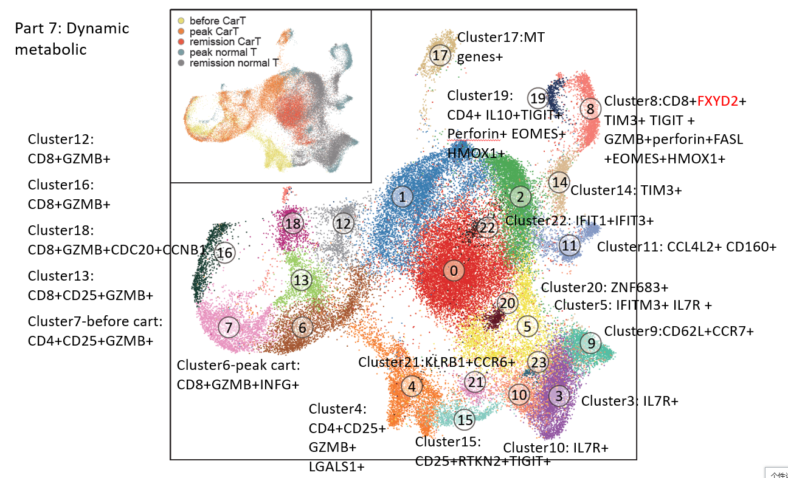

```
library(Seurat)
setwd("g:/work/2018_01/cart_singleCellInDrop-seq/data_12_10xgenomics/outs/my_output/out201907/")
T.integrated <- readRDS("1_cart_ygh_intergrated.rds")
dim(T.integrated)
T.integrated <- FindNeighbors(T.integrated, reduction = "pca", dims = 1:70)
T.integrated <- FindClusters(T.integrated, resolution = 1)

LYZ_cells <- rownames(subset(T.integrated@meta.data, integrated_snn_res.0.5 == 14))
length(LYZ_cells)
#[1] 308

### ygh.samples seurat3 remove batch
setwd("g:/work/2018_01/cart_singleCellInDrop-seq/data_12_10xgenomics/outs/")
library(Seurat)
ygh.data.s1 <- Read10X(data.dir="yeguanhuo_S1/filtered_feature_bc_matrix")
ygh.data.s2 <- Read10X(data.dir="yeguanhuo_S2/filtered_feature_bc_matrix")
ygh.data.s3 <- Read10X(data.dir="yeguanhuo_S3/filtered_feature_bc_matrix")
ygh.data.s4 <- Read10X(data.dir="yeguanhuo_S4/filtered_feature_bc_matrix")
ygh.data.s5 <- Read10X(data.dir="yeguanhuo_S5/filtered_feature_bc_matrix")
ygh.data.s6 <- Read10X(data.dir="yeguanhuo_S6/filtered_feature_bc_matrix")
colnames(ygh.data.s1) <- paste("sample1",1:ncol(ygh.data.s1),sep="_")
colnames(ygh.data.s2) <- paste("sample2",1:ncol(ygh.data.s2),sep="_")
colnames(ygh.data.s3) <- paste("sample3",1:ncol(ygh.data.s3),sep="_")
colnames(ygh.data.s4) <- paste("sample4",1:ncol(ygh.data.s4),sep="_")
colnames(ygh.data.s5) <- paste("sample5",1:ncol(ygh.data.s5),sep="_")
colnames(ygh.data.s6) <- paste("sample6",1:ncol(ygh.data.s6),sep="_")
ygh.data.s1 <- as.data.frame(ygh.data.s1)
ygh.data.s2 <- as.data.frame(ygh.data.s2)
ygh.data.s3 <- as.data.frame(ygh.data.s3)
ygh.data.s4 <- as.data.frame(ygh.data.s4)
ygh.data.s5 <- as.data.frame(ygh.data.s5)
ygh.data.s6 <- as.data.frame(ygh.data.s6)
ygh.data.s1 <- ygh.data.s1[,!colnames(ygh.data.s1) %in% LYZ_cells]
ygh.data.s2 <- ygh.data.s2[,!colnames(ygh.data.s2) %in% LYZ_cells]
ygh.data.s3 <- ygh.data.s3[,!colnames(ygh.data.s3) %in% LYZ_cells]
ygh.data.s4 <- ygh.data.s4[,!colnames(ygh.data.s4) %in% LYZ_cells]
ygh.data.s5 <- ygh.data.s5[,!colnames(ygh.data.s5) %in% LYZ_cells]
ygh.data.s6 <- ygh.data.s6[,!colnames(ygh.data.s6) %in% LYZ_cells]

## sample 2 extract T cells ##
carts2_T <- read.table("my_output/out201907/1_yghs2_Tcell_metadata.txt")
ygh.data.s2 <- ygh.data.s2[,colnames(ygh.data.s2) %in% rownames(carts2_T)]
### merge sample 1 and sample 2
yghs1s2.data <- cbind(as.data.frame(ygh.data.s1),ygh.data.s2)
dim(yghs1s2.data)
#[1] 33538  8467
yghs1s2 <- CreateSeuratObject(yghs1s2.data, min.cells = 3, min.features = 200, project = "CART_10X_s1s2")
yghs1s2$condition <- "s1s2"
yghs1s2[["percent.mt"]] <- PercentageFeatureSet(object = yghs1s2, pattern = "^MT-")
VlnPlot(object = yghs1s2, features = c("nFeature_RNA", "nCount_RNA", "percent.mt"), ncol = 3)
yghs1s2 <- subset(x = yghs1s2, subset = nFeature_RNA > 200 & nCount_RNA < 30000 & percent.mt < 5)
yghs1s2 <- NormalizeData(object =yghs1s2, normalization.method = "LogNormalize", scale.factor = 10000)
yghs1s2 <- FindVariableFeatures(object =yghs1s2, selection.method = "vst", nfeatures = 2000)

### merge sample 3 and sample 4
yghs3s4.data <- cbind(ygh.data.s3,ygh.data.s4)
dim(yghs3s4.data)
#[1] 33538 19805
yghs3s4 <- CreateSeuratObject(yghs3s4.data, min.cells = 3, min.features = 200, project = "CART_10X_s3s4")
yghs3s4$condition <- "s3s4"
yghs3s4[["percent.mt"]] <- PercentageFeatureSet(object = yghs3s4, pattern = "^MT-")
VlnPlot(object = yghs3s4, features = c("nFeature_RNA", "nCount_RNA", "percent.mt"), ncol = 3)
yghs3s4 <- subset(x = yghs3s4, subset = nFeature_RNA > 200 & nCount_RNA < 20000 & percent.mt < 5)
yghs3s4 <- NormalizeData(object =yghs3s4, normalization.method = "LogNormalize", scale.factor = 10000)
yghs3s4 <- FindVariableFeatures(object =yghs3s4, selection.method = "vst", nfeatures = 2000)

### merge sample 5 and sample 6
yghs5s6.data <- cbind(ygh.data.s5,ygh.data.s6)
dim(yghs5s6.data)
#[1] 33538 28896
yghs5s6 <- CreateSeuratObject(yghs5s6.data, min.cells = 3, min.features = 200, project = "CART_10X_s5s6")
yghs5s6$condition <- "s5s6"
yghs5s6[["percent.mt"]] <- PercentageFeatureSet(object = yghs5s6, pattern = "^MT-")
VlnPlot(object = yghs5s6, features = c("nFeature_RNA", "nCount_RNA", "percent.mt"), ncol = 3)
yghs5s6 <- subset(x = yghs5s6, subset = nFeature_RNA > 200 & nCount_RNA < 10000 & percent.mt < 5)
yghs5s6 <- NormalizeData(object =yghs5s6, normalization.method = "LogNormalize", scale.factor = 10000)
yghs5s6 <- FindVariableFeatures(object =yghs5s6, selection.method = "vst", nfeatures = 2000)

dim(yghs1s2)
[1] 16591  7235
dim(yghs3s4)
[1] 17046 19797
dim(yghs5s6)
[1] 16542 28456

T.anchors <- FindIntegrationAnchors(object.list = list(yghs1s2, yghs3s4, yghs5s6), dims = 1:60, anchor.features = 5000)
T.integrated <- IntegrateData(anchorset = T.anchors, dims = 1:60)
DefaultAssay(T.integrated) <- "integrated"
library(ggplot2)
library(cowplot)
# Run the standard workflow for visualization and clustering
T.integrated <- ScaleData(T.integrated, verbose = FALSE)
T.integrated <- RunPCA(T.integrated, npcs = 70, verbose = FALSE)
T.integrated <- RunUMAP(T.integrated, reduction = "pca", dims = 1:70)
T.integrated <- FindNeighbors(T.integrated, reduction = "pca", dims = 1:70)
T.integrated <- FindClusters(T.integrated, resolution = 0.5)
T.integrated <- FindClusters(T.integrated, resolution = 1)
saveRDS(T.integrated, file = "my_output/out201907/1_cart_ygh_intergrated.rds")
DefaultAssay(T.integrated) <- "RNA"
saveRDS(T.integrated, file = "my_output/out201907/1_cart_ygh_intergrated.rds")

### 
setwd("Documents/work/2018/cart_singleCellInDrop-seq/data_12_10xgenomics/outs/my_output/out201907")
#setwd("g:/work/2018_01/cart_singleCellInDrop-seq/data_12_10xgenomics/outs/my_output/out201907/")
library(Seurat)
T.integrated <- readRDS("1_cart_ygh_intergrated.rds")
head(T.integrated@meta.data)
#          orig.ident nCount_RNA nFeature_RNA condition percent.mt integrated_snn_res.0.5 seurat_clusters integrated_snn_res.1
#sample1_1    sample1       7959         2322      s1s2   1.985174                      7               7                    7
#sample1_4    sample1       8454         2217      s1s2   3.879820                      3               4                    4
#sample1_5    sample1       6170         1940      s1s2   3.176661                      3               4                    4
#sample1_7    sample1       9726         2514      s1s2   2.673247                      9              18                   18
#sample1_8    sample1       6570         1972      s1s2   2.526636                      3               4                    4

p1 <- DimPlot(T.integrated, reduction = "umap", label = TRUE,split.by="orig.ident")
p2 <- DimPlot(T.integrated, reduction = "umap", label = TRUE)
plot_grid(p1, p2)

mycolors = c("#E71918","#357FBC","#45AD4C","#A351A3","#FF7E00","#FFED22","#AD5322","#F99DD1","#fb8072","#59C4A6","#FD8E63","#90A1CF","#9A9A9A","#A6DB4C","#E3C594","#92D3C8","#003c30","#dfc27d","#c51b7d","#053061","#67001f","#E88AC0","#1a1a1a","#17617B")
pdf("raw_figure/1_intergrated_UMAP_cluster.pdf")
DimPlot(T.integrated, reduction = "umap", label = TRUE, cols=mycolors,label.size=8, vector.friendly=T,pt.size=0.1,order=c(23:0))

cart <- T.integrated@meta.data[T.integrated@meta.data$orig.ident %in% c("sample1","sample3","sample5"),]
pdf("raw_figure/1_intergrated_UMAP_samples.pdf")
DimPlot(T.integrated, reduction = "umap", group.by = "orig.ident", cells.use = rownames(cart), label = TRUE, cols=color,label.size=8, vector.friendly=T,pt.size=0.1,order=c(6:0))

## plot beautify 
p <- DimPlot(T.integrated, reduction = "umap", label = TRUE, cols= mycolors,label.size=20, vector.friendly=T,pt.size=0.1,order=c(23:0))
pbuild <- ggplot2::ggplot_build(p) # Use ggplot_build to deconstruct the ggplot object
pdata <- pbuild$data[[1]] #
metaData <-T.integrated@meta.data
pdata$samples <- metaData$orig.ident
pdata$group <- metaData$seurat_clusters
rownames(pdata) <- rownames(metaData)
head(pdata)
#           colour         x          y PANEL group shape size fill alpha stroke samples
#sample1_1 #E71918 -2.863143 -1.0044104     1     7    19  0.1   NA    NA    0.5 sample1
#sample1_4 #E71918 -1.316150 -4.7908411     1     4    19  0.1   NA    NA    0.5 sample1
#sample1_5 #E71918 -2.882886 -0.5922214     1     4    19  0.1   NA    NA    0.5 sample1
#sample1_7 #E71918 -2.267895  0.1008964     1    18    19  0.1   NA    NA    0.5 sample1
write.table(pdata,"1_UMAP_data_color.txt",sep="\t",quote=F)
meta.col <- data.frame(table(pdata$colour))
aa <- data.frame(table(pdata$group))
meta.col <- meta.col[order(meta.col$Freq),]
aa <- aa[order(aa$Freq),]
meta.col$group = aa$Var1
head(meta.col)
#      Var1 Freq group
#3  #17617B   91    23
#4  #1a1a1a  230    22
#19 #E88AC0  383    21
write.table(meta.col,"1_UMAP_cluster_color.txt",sep="\t",quote=F,row.names=F)

p <- ggplot(pdata, aes(x,y)) + geom_point(colour = pdata$colour,alpha=.8,size=.2) +
theme_bw() +
scale_colour_manual(values=mycolors)  +
labs(title = "") +
theme(axis.line=element_blank(),axis.text.x=element_blank(),
          axis.text.y=element_blank(),axis.ticks=element_blank(),
          axis.title.x=element_blank(),
          axis.title.y=element_blank(),legend.position="none",
          panel.background=element_blank(),
          #panel.border=element_blank(),
          panel.grid.major=element_blank(),
          panel.grid.minor=element_blank(),plot.background=element_blank())
ggsave("raw_figure/1_intergrated_UMAP_clusters.png",units="in", dpi=300, device='png')

 
p <- DimPlot(T.integrated, reduction = "umap", group.by = "orig.ident", cols=mycolors, label.size=20, vector.friendly=T,pt.size=0.1)
pbuild <- ggplot2::ggplot_build(p) # Use ggplot_build to deconstruct the ggplot object
pdata <- pbuild$data[[1]] #
metaData <-T.integrated@meta.data
pdata$samples <- metaData$orig.ident
pdata$group <- metaData$seurat_clusters
rownames(pdata) <- rownames(metaData)
head(pdata)
#           colour         x          y PANEL group shape size fill alpha stroke samples
#sample1_1 #E71918 -2.863143 -1.0044104     1     7    19  0.1   NA    NA    0.5 sample1
#sample1_4 #E71918 -1.316150 -4.7908411     1     4    19  0.1   NA    NA    0.5 sample1
#sample1_5 #E71918 -2.882886 -0.5922214     1     4    19  0.1   NA    NA    0.5 sample1
#sample1_7 #E71918 -2.267895  0.1008964     1    18    19  0.1   NA    NA    0.5 sample1

p <- ggplot(pdata, aes(x,y)) + geom_point(colour = pdata$colour,alpha=.8,size=.2) +
theme_bw() +
scale_colour_manual(values=mycolors)  +
labs(title = "") +
theme(axis.line=element_blank(),axis.text.x=element_blank(),
          axis.text.y=element_blank(),axis.ticks=element_blank(),
          axis.title.x=element_blank(),
          axis.title.y=element_blank(),legend.position="none",
          panel.background=element_blank(),
          panel.border=element_blank(),
          panel.grid.major=element_blank(),
          panel.grid.minor=element_blank(),plot.background=element_blank())
ggsave("raw_figure/1_intergrated_UMAP_samples.png",units="in", dpi=300, device='png')

exp <- GetAssayData(object = T.integrated, slot = 'data',assay="RNA")

library(RColorBrewer)
#ggplot(pdata, aes(x,y)) +
#geom_point(aes(col=CD4),alpha=.8,size=0.05) +
#     theme_bw() +
#     scale_colour_distiller(palette="Spectral")

pdata$CD8A <- as.numeric(exp["CD8A",])
ggplot(pdata, aes(x,y)) +
geom_point(aes(col=CD8A),alpha=.8,size=0.01) +
     theme_bw() +
     scale_color_viridis(option = "inferno") +
    theme(axis.line=element_blank(),axis.text.x=element_blank(),
          axis.text.y=element_blank(),axis.ticks=element_blank(),
          axis.title.x=element_blank(),
          axis.title.y=element_blank(),legend.position=c(0.1,0.8),
          panel.background=element_blank(),
          panel.border=element_blank(),
          panel.grid.major=element_blank(),
          panel.grid.minor=element_blank(),plot.background=element_blank())
ggsave("raw_figure/1_intergrated_UMAP_marker_CD8A.png",units="in", dpi=300, device='png')

pdata$CD4 <- as.numeric(exp["CD4",])
ggplot(pdata, aes(x,y)) +
geom_point(aes(col=CD4),alpha=.8,size=0.01) +
     theme_bw() +
     scale_color_viridis(option = "inferno") +
    theme(axis.line=element_blank(),axis.text.x=element_blank(),
          axis.text.y=element_blank(),axis.ticks=element_blank(),
          axis.title.x=element_blank(),
          axis.title.y=element_blank(),legend.position=c(0.1,0.8),
          panel.background=element_blank(),
          panel.border=element_blank(),
          panel.grid.major=element_blank(),
          panel.grid.minor=element_blank(),plot.background=element_blank())
ggsave("raw_figure/1_intergrated_UMAP_marker_CD4.png",units="in", dpi=300, device='png')

pdata$GZMB <- as.numeric(exp["GZMB",])
ggplot(pdata, aes(x,y)) +
geom_point(aes(col=GZMB),alpha=.8,size=0.01) +
     theme_bw() +
     scale_color_viridis(option = "inferno") +
    theme(axis.line=element_blank(),axis.text.x=element_blank(),
          axis.text.y=element_blank(),axis.ticks=element_blank(),
          axis.title.x=element_blank(),
          axis.title.y=element_blank(),legend.position=c(0.1,0.8),
          panel.background=element_blank(),
          panel.border=element_blank(),
          panel.grid.major=element_blank(),
          panel.grid.minor=element_blank(),plot.background=element_blank())
ggsave("raw_figure/1_intergrated_UMAP_marker_GZMB.png",units="in", dpi=300, device='png')

pdata$IFNG <- as.numeric(exp["IFNG",])
ggplot(pdata, aes(x,y)) +
geom_point(aes(col=IFNG),alpha=.8,size=0.01) +
     theme_bw() +
     scale_color_viridis(option = "inferno") +
    theme(axis.line=element_blank(),axis.text.x=element_blank(),
          axis.text.y=element_blank(),axis.ticks=element_blank(),
          axis.title.x=element_blank(),
          axis.title.y=element_blank(),legend.position=c(0.1,0.8),
          panel.background=element_blank(),
          panel.border=element_blank(),
          panel.grid.major=element_blank(),
          panel.grid.minor=element_blank(),plot.background=element_blank())
ggsave("raw_figure/1_intergrated_UMAP_marker_IFNG.png",units="in", dpi=300, device='png')

pdata$TNF <- as.numeric(exp["TNF",])
ggplot(pdata, aes(x,y)) +
geom_point(aes(col=TNF),alpha=.8,size=0.01) +
     theme_bw() +
     scale_color_viridis(option = "inferno") +
    theme(axis.line=element_blank(),axis.text.x=element_blank(),
          axis.text.y=element_blank(),axis.ticks=element_blank(),
          axis.title.x=element_blank(),
          axis.title.y=element_blank(),legend.position=c(0.1,0.8),
          panel.background=element_blank(),
          panel.border=element_blank(),
          panel.grid.major=element_blank(),
          panel.grid.minor=element_blank(),plot.background=element_blank())
ggsave("raw_figure/1_intergrated_UMAP_marker_TNF.png",units="in", dpi=300, device='png')

pdata$SELL <- as.numeric(exp["SELL",])
ggplot(pdata, aes(x,y)) +
geom_point(aes(col=SELL),alpha=.8,size=0.01) +
     theme_bw() +
     scale_color_viridis(option = "inferno") +
    theme(axis.line=element_blank(),axis.text.x=element_blank(),
          axis.text.y=element_blank(),axis.ticks=element_blank(),
          axis.title.x=element_blank(),
          axis.title.y=element_blank(),legend.position=c(0.1,0.8),
          panel.background=element_blank(),
          panel.border=element_blank(),
          panel.grid.major=element_blank(),
          panel.grid.minor=element_blank(),plot.background=element_blank())
ggsave("raw_figure/1_intergrated_UMAP_marker_SELL.png",units="in", dpi=300, device='png')

pdata$CCR7 <- as.numeric(exp["CCR7",])
ggplot(pdata, aes(x,y)) +
geom_point(aes(col=CCR7),alpha=.8,size=0.01) +
     theme_bw() +
     scale_color_viridis(option = "inferno") +
    theme(axis.line=element_blank(),axis.text.x=element_blank(),
          axis.text.y=element_blank(),axis.ticks=element_blank(),
          axis.title.x=element_blank(),
          axis.title.y=element_blank(),legend.position=c(0.1,0.8),
          panel.background=element_blank(),
          panel.border=element_blank(),
          panel.grid.major=element_blank(),
          panel.grid.minor=element_blank(),plot.background=element_blank())
ggsave("raw_figure/1_intergrated_UMAP_marker_CCR7.png",units="in", dpi=300, device='png')

pdata$IL2RA <- as.numeric(exp["IL2RA",])
ggplot(pdata, aes(x,y)) +
geom_point(aes(col=IL2RA),alpha=.8,size=0.01) +
     theme_bw() +
     scale_color_viridis(option = "inferno") +
    theme(axis.line=element_blank(),axis.text.x=element_blank(),
          axis.text.y=element_blank(),axis.ticks=element_blank(),
          axis.title.x=element_blank(),
          axis.title.y=element_blank(),legend.position=c(0.1,0.8),
          panel.background=element_blank(),
          panel.border=element_blank(),
          panel.grid.major=element_blank(),
          panel.grid.minor=element_blank(),plot.background=element_blank())
ggsave("raw_figure/1_intergrated_UMAP_marker_IL2RA.png",units="in", dpi=300, device='png')

pdata$IL7R <- as.numeric(exp["IL7R",])
ggplot(pdata, aes(x,y)) +
geom_point(aes(col=IL7R),alpha=.8,size=0.01) +
     theme_bw() +
     scale_color_viridis(option = "inferno") +
    theme(axis.line=element_blank(),axis.text.x=element_blank(),
          axis.text.y=element_blank(),axis.ticks=element_blank(),
          axis.title.x=element_blank(),
          axis.title.y=element_blank(),legend.position=c(0.1,0.8),
          panel.background=element_blank(),
          panel.border=element_blank(),
          panel.grid.major=element_blank(),
          panel.grid.minor=element_blank(),plot.background=element_blank())
ggsave("raw_figure/1_intergrated_UMAP_marker_IL7R.png",units="in", dpi=300, device='png')


FeaturePlot(object = T.integrated, features = c("GZMB", "LAG3","IFNG","TNF"))


Idents(T.integrated) <- "integrated_snn_res.0.5"
Idents(T.integrated) <- "seurat_clusters"
a <- subset(T.integrated@meta.data, seurat_clusters == 22)
b <- subset(T.integrated@meta.data, seurat_clusters == 23)
table(a$orig.ident)
#sample1 sample3 sample4 sample5 sample6
#     21      13      13      89      94
table(b$orig.ident)
#sample1 sample3 sample4 sample6
#      2       1      40      48


meta_gzmb <- readRDS("gx/metadata0707.rds")
p <- DimPlot(T.integrated, reduction = "umap", group.by = "orig.ident", cols=mycolors, label.size=20, vector.friendly=T,pt.size=0.1)
pbuild <- ggplot2::ggplot_build(p) # Use ggplot_build to deconstruct the ggplot object
pdata <- pbuild$data[[1]]
pdata$gzmb <- as.numeric(meta_gzmb$datacyto)
ggplot(pdata, aes(x,y)) +
geom_point(aes(col=gzmb),alpha=.8,size=0.01) +
     theme_bw() +
     scale_color_viridis(option = "inferno") +
    theme(axis.line=element_blank(),axis.text.x=element_blank(),
          axis.text.y=element_blank(),axis.ticks=element_blank(),
          axis.title.x=element_blank(),
          axis.title.y=element_blank(),legend.position=c(0.1,0.8),
          panel.background=element_blank(),
          panel.border=element_blank(),
          panel.grid.major=element_blank(),
          panel.grid.minor=element_blank(),plot.background=element_blank())

pdata$gzmb2 <- colMeans(df)
pdata$gzmb3 <- colSums(df)
ggplot(pdata, aes(x,y)) +
geom_point(aes(col=gzmb3),alpha=.8,size=0.01) +
     theme_bw() +
     scale_color_viridis(option = "inferno") +
    theme(axis.line=element_blank(),axis.text.x=element_blank(),
          axis.text.y=element_blank(),axis.ticks=element_blank(),
          axis.title.x=element_blank(),
          axis.title.y=element_blank(),legend.position=c(0.1,0.8),
          panel.background=element_blank(),
          panel.border=element_blank(),
          panel.grid.major=element_blank(),
          panel.grid.minor=element_blank(),plot.background=element_blank())

pdata$CD247 <- as.numeric(exp["CD247",])
ggplot(pdata, aes(x,y)) +
geom_point(aes(col=CD247),alpha=.8,size=0.01) +
     theme_bw() +
     scale_color_viridis(option = "inferno") +
    theme(axis.line=element_blank(),axis.text.x=element_blank(),
          axis.text.y=element_blank(),axis.ticks=element_blank(),
          axis.title.x=element_blank(),
          axis.title.y=element_blank(),legend.position=c(0.1,0.8),
          panel.background=element_blank(),
          panel.border=element_blank(),
          panel.grid.major=element_blank(),
          panel.grid.minor=element_blank(),plot.background=element_blank())
ggsave("raw_figure/1_intergrated_UMAP_marker_CD247.png",units="in", dpi=300, device='png')

pdata$CD28 <- as.numeric(exp["CD28",])
ggplot(pdata, aes(x,y)) +
geom_point(aes(col=CD28),alpha=.8,size=0.01) +
     theme_bw() +
     scale_color_viridis(option = "inferno") +
    theme(axis.line=element_blank(),axis.text.x=element_blank(),
          axis.text.y=element_blank(),axis.ticks=element_blank(),
          axis.title.x=element_blank(),
          axis.title.y=element_blank(),legend.position=c(0.1,0.8),
          panel.background=element_blank(),
          panel.border=element_blank(),
          panel.grid.major=element_blank(),
          panel.grid.minor=element_blank(),plot.background=element_blank())
ggsave("raw_figure/1_intergrated_UMAP_marker_CD28.png",units="in", dpi=300, device='png')
```


## cluster correlation 
```
library(Seurat)
setwd("g:/work/2018_01/cart_singleCellInDrop-seq/data_12_10xgenomics/outs/my_output/out201907/")
T.integrated <- readRDS("1_cart_ygh_intergrated.rds")
dim(T.integrated)
df <- as.data.frame(GetAssayData(object = T.integrated, slot = 'data'))
Exp_mean <- aggregate(t(df), list(T.integrated@meta.data$seurat_clusters), mean)
head(Exp_mean[,1:6])
#  Group.1   AL627309.1 AL669831.5       FAM87B   LINC00115      FAM41C
#1       0 0.0006410555 0.02160598 0.0000000000 0.005077823 0.006725312
#2       1 0.0009848494 0.01361862 0.0000000000 0.005988654 0.001817966
rownames(Exp_mean) <- paste("cluster",Exp_mean[,1],sep="-")
Exp_mean <- Exp_mean[,-1]
head(Exp_mean[,1:6])
#            AL627309.1 AL669831.5       FAM87B   LINC00115      FAM41C     NOC2L
#cluster-0 0.0006410555 0.02160598 0.0000000000 0.005077823 0.006725312 0.1643291
#cluster-1 0.0009848494 0.01361862 0.0000000000 0.005988654 0.001817966 0.1522231
#cluster-2 0.0003684140 0.01569057 0.0000000000 0.004512126 0.003355183 0.1208239
df <- cor(t(Exp_mean), method = "pearson")
```
##  annotation by intergrate data
```
library(Seurat)
setwd("g:/work/2018_01/cart_singleCellInDrop-seq/data_12_10xgenomics/outs/my_output/out201907/")
T.integrated <- readRDS("1_cart_ygh_intergrated.rds")
dim(T.integrated)
#[1]  18501 55488

#### top 20 marker each cluster ##########
T.markers <- FindAllMarkers(T.integrated, only.pos = TRUE, min.pct = 0.25, logfc.threshold = 0.25)
library(dplyr)
marker_top20 <- as.data.frame(T.markers %>% group_by(cluster) %>% top_n(n = 20, wt = avg_logFC))
head(marker_top20)
#  p_val avg_logFC pct.1 pct.2 p_val_adj cluster   gene
#1     0 0.8613242 0.799 0.553         0       0    JUN
#2     0 0.7175217 0.924 0.712         0       0   CD69
#3     0 0.6397580 0.959 0.584         0       0   GZMK
#4     0 0.6230418 0.955 0.840         0       0   JUNB
#5     0 0.5993125 0.736 0.516         0       0 PMAIP1
write.table(marker_top20,"T_integrated_top20marker.txt",quote=F,sep="\t")
marker_top40 <- as.data.frame(T.markers %>% group_by(cluster) %>% top_n(n = 40, wt = avg_logFC))
head(marker_top40)
#  p_val avg_logFC pct.1 pct.2 p_val_adj cluster   gene
#1     0 0.8613242 0.799 0.553         0       0    JUN
#2     0 0.7175217 0.924 0.712         0       0   CD69
#3     0 0.6397580 0.959 0.584         0       0   GZMK
#4     0 0.6230418 0.955 0.840         0       0   JUNB
#5     0 0.5993125 0.736 0.516         0       0 PMAIP1
write.table(marker_top40,"T_integrated_top40marker.txt",quote=F,sep="\t")

#### top 20 marker heatmap ########## 
library(pheatmap)
marker_top20 <- read.table("T_integrated_top20marker.txt") 
hv_genes <- GetAssayData(object = T.integrated, slot = 'scale.data',assay="integrated")
genes <- intersect(rownames(hv_genes), marker_top20$gene)
df <- as.data.frame(GetAssayData(object = T.integrated, slot = 'scale.data',assay="integrated"))[genes,]
#df <- as.data.frame(GetAssayData(object = T.integrated, slot = 'data'))[marker_top20$gene,]
gzmb <- c("CCL4","COTL1","HOPX","GNLY","NKG7","PRF1","CCL3","FGFBP2","GZMB")
#df <- as.data.frame(GetAssayData(object = T.integrated, slot = 'data'))[marker_top20$gene,]
#dim(df)
[1]   251 55488
table(T.integrated@meta.data$seurat_clusters)
#    0     1     2     3     4     5     6     7     8     9    10    11    12
#11460  6648  5496  4582  3510  3126  2568  2479  1984  1930  1587  1496  1244
#   13    14    15    16    17    18    19    20    21    22    23
#1227   999   934   925   896   813   480   400   383   230    91

## 随机取200细胞做热图，失败。细胞太多，不好看
tmeta <- T.integrated@meta.data
tmeta$samples = rownames(tmeta)
random_200cells <- as.data.frame(subset(tmeta, seurat_clusters != 23) %>% group_by(seurat_clusters) %>% sample_n(200))  ## cluster 23细胞少不随机，直接取
random_total <- rbind(random_200cells, subset(tmeta, seurat_clusters == 23))
head(random_total)
  orig.ident nCount_RNA nFeature_RNA condition percent.mt integrated_snn_res.0.5 seurat_clusters integrated_snn_res.1       samples
1    sample6       1805          720      s5s6   3.379501                      0               0                    0  sample6_2014
2    sample5       4080         1345      s5s6   2.401961                      0               0                    0   sample5_790
3    sample5       3115         1126      s5s6   1.861958                      0               0                    0  sample5_6804
4    sample5       3929         1296      s5s6   2.850598                      0               0                    0  sample5_1787
dff <- df[,random_total$samples]
dim(dff)
[1]  480 4691

###  aggregate mean by each cluster each samples

#Exp_mean <- aggregate(t(df), list(T.integrated@meta.data$seurat_clusters,T.integrated@meta.data$orig.ident), mean)
#rownames(Exp_mean) <- paste(Exp_mean$Group.1, Exp_mean$Group.2,sep="_")
Exp_mean <- aggregate(t(df), list(T.integrated@meta.data$seurat_clusters), mean)
rownames(Exp_mean) <- paste(Exp_mean$Group.1, sep="_")
head(Exp_mean[,1:5])
#          Group.1 Group.2       JUN      CD69      GZMK
#sample1_0 sample1       0 1.6214916 1.0319384 0.4469939
#sample3_0 sample3       0 1.3075854 1.2516440 2.9633387
#sample4_0 sample4       0 0.9478096 1.3488226 2.7557349
#sample5_0 sample5       0 2.1728048 2.6239015 2.9503187
#Exp_mean <- Exp_mean[,-c(1,2)]
Exp_mean <- Exp_mean[,-1]
rownames(Exp_mean) <- paste("cluster",rownames(Exp_mean),sep="_")

pheatmap(t(Exp_mean), cluster_col=T,show_rownames=F)

#breaks
pheatmap(t(Exp_mean),
         scale = "none",
         color = viridis(9),
         #legend_breaks=seq(-8,8,2),
         breaks=bk)

pdf("raw_figure/2_clusterMarker_heatmap2.pdf")
bk <- c(-3,seq(-1,2,by=0.5),6)
pheatmap(t(Exp_mean),
         scale = "none",
         color = c(colorRampPalette(c("#206DAA", "#0b0e12"))(3), colorRampPalette(c("#0b0e12", "#ef9f3e"))(5))[-3],
         #legend_breaks=seq(-8,8,2),
         show_rownames=F,
         #cutree_cols = 4,
         breaks=bk)

pdf("raw_figure/2_clusterMarker_heatmap2_order.pdf", height=20)
bk <- c(-3,seq(-1,2,by=0.5),8)
pheatmap(t(Exp_mean[c(17,8,19,13,7,14, 23,20,9,15,11,5,6,3, 18,12,21,1,2, 24,4,10,16,22),]),
         scale = "none",
         color = c(colorRampPalette(c("#206DAA", "#0b0e12"))(3), colorRampPalette(c("#0b0e12", "#ef9f3e"))(5))[-3],
         #legend_breaks=seq(-8,8,2),
         show_rownames=T,
         fontsize_row = 4,
         cluster_cols = F,   
         gaps_col = c(1,6,7,10,13,19),
         breaks=bk)

pdf("raw_figure/2_clusterMarker_heatmap.pdf")
bk <- c(-3,seq(0,2,by=0.5),3,4,6)
pheatmap(t(Exp_mean),
         scale = "none",
         color = colorRampPalette(c("white", "navy"))(8),
         #legend_breaks=seq(-8,8,2),
         show_rownames=F,
         cutree_cols = 4,
         #breaks=bk)

## heatmap 
markers <- marker_top20[marker_top20$gene %in% colnames(Exp_mean),]  
```

## 按真实的CART ：Normal T 比例 显示 UMAP， 并计算比例。
```
library(grid)
library(dplyr)
library(reshape2)
setwd("g:/work/2018_01/cart_singleCellInDrop-seq/clinicalAndSampleInfo/from_lixia/")
ygh <- read.csv("ygh_summary.txt",head=T,sep="\t")
ygh <- ygh[-c(1,16),]
ygh$lymphoc_CD3neg_absoluteValue <- ygh$lymphocytes1*(1-ygh$CD45*ygh$CD3*0.0001)*0.01
ygh$PBMC_nonlymphoc <- (1-ygh$lymphocytes1*0.01)
ygh$lymphoc_CD3_CARneg <- ygh$lymphocytes1*ygh$CD45*ygh$CD3*ygh$CARneg*10^-8
ygh$lymphoc_CD3_CARpos <- ygh$lymphocytes1*ygh$CD45*ygh$CD3*ygh$CARpos*10^-8
real_percent <- ygh[ygh$days_CART_after %in% c("day1", "day8", "day15"),c(2,19,18)]
#real_percent
#   days_CART_after lymphoc_CD3_CARneg lymphoc_CD3_CARpos
#2             day1        0.002715881       0.0000424615
#9             day8        0.028651817       0.8345273126
#15           day15        0.027995505       0.1819707833
real_percent <- real_percent[,-1]
real_cell_count <- round(real_percent * 14000)
#   lymphoc_CD3_CARpos lymphoc_CD3_CARneg
#2                   1                 38
#9               11683                401
#15               2548                392

library(Seurat)
setwd("g:/work/2018_01/cart_singleCellInDrop-seq/data_12_10xgenomics/outs/my_output/out201907/")
T.integrated <- readRDS("1_cart_ygh_intergrated.rds")
table(T.integrated@meta.data$orig.ident)
#sample1 sample2 sample3 sample4 sample5 sample6
#   7204      31   11848    7949    9464   18992
## 根据上面的real_cell_count 随机取相对应个数细胞
tmeta <- T.integrated@meta.data
tmeta$samples = rownames(tmeta)
random_sample1 <- as.data.frame(subset(tmeta, orig.ident == "sample1") %>% sample_n(1))  
random_sample2 <- as.data.frame(subset(tmeta, orig.ident == "sample2"))  ## sample 2 数量不够不随机
random_sample3 <- as.data.frame(subset(tmeta, orig.ident == "sample3") %>% sample_n(11683))  
random_sample4 <- as.data.frame(subset(tmeta, orig.ident == "sample4") %>% sample_n(401))  
random_sample5 <- as.data.frame(subset(tmeta, orig.ident == "sample5") %>% sample_n(2548))  
random_sample6 <- as.data.frame(subset(tmeta, orig.ident == "sample6") %>% sample_n(392))  
random_total <- rbind(random_sample1, random_sample2, random_sample3, random_sample4, random_sample5, random_sample6)
head(random_total)
#             orig.ident nCount_RNA nFeature_RNA condition percent.mt integrated_snn_res.0.5 seurat_clusters integrated_snn_res.1      samples
#1               sample1      18172         3670      s1s2   3.395333                      7               7                    7 sample1_3956
#sample2_86      sample2       1288          563      s1s2   2.018634                     10               9                    9   sample2_86
#sample2_558     sample2       2947         1273      s1s2   2.578894                      2               2                    2  sample2_558

##### percentage of samples for each cluster ### strack plot
plotdata <- random_total[,c(1,7)]
head(plotdata)
          orig.ident seurat_clusters
sample1_1    sample1               7
sample1_4    sample1               4
sample1_5    sample1               4
sample1_7    sample1              18
library(plyr)
library(scales)
library(ggplot2)
df <- ddply(plotdata, .(plotdata$orig.ident, plotdata$seurat_clusters), nrow)
names(df) <- c("samples", "intergrate_cluster","freq")
head(df)
#  samples intergrate_cluster freq
#1 sample1                  7    1
#2 sample2                  1    1
#3 sample2                  2    7
#4 sample2                  3    6
#5 sample2                  9   17

ggplot(data = df, aes(x = intergrate_cluster, y = freq, fill = samples)) + geom_bar(stat = "identity")

mycolors <- c("#f3e96b", "#c2d3da", "#f28a30", "#81a3a7", "#f05837", "#8a8683")
ggplot(df, aes(fill=samples, y=freq, x=intergrate_cluster)) +
    geom_bar( stat="identity", position="fill") +
    scale_y_continuous(labels = percent_format()) +  #scale_x_discrete(limits=c("xhp_BM_before","xhp_PB_before","xhp_PB_residual","xhp_BM_relapse","xhp_PB_relapse"),
    labels = c("BM before","PB_before","PB_residual","BM_relapse","PB_relapse")) +
    scale_fill_manual(values = mycolors) +
    theme_bw() +
    theme(panel.grid.major = element_blank(), panel.grid.minor = element_blank()) +
    labs(x="")


##### percentage of samples for each cluster ### strack plot
plotdata <- T.integrated@meta.data[,c(1,7)]
head(plotdata)
          orig.ident seurat_clusters
sample1_1    sample1               7
sample1_4    sample1               4
sample1_5    sample1               4
sample1_7    sample1              18


library(plyr)
library(scales)
library(ggplot2)
df <- ddply(plotdata, .(plotdata$orig.ident, plotdata$seurat_clusters), nrow)
names(df) <- c("samples", "intergrate_cluster","freq")
head(df)
#  samples intergrate_cluster freq
#1 sample1                  0  145
#2 sample1                  1   51
#3 sample1                  2   12
#4 sample1                  3   18
ggplot(df, aes(fill=samples, y=freq, x=intergrate_cluster)) +
    geom_bar( stat="identity", position="fill") +
    scale_y_continuous(labels = percent_format()) +
    scale_x_discrete(limits=c("xhp_BM_before","xhp_PB_before","xhp_PB_residual","xhp_BM_relapse","xhp_PB_relapse"),labels = c("BM before","PB_before","PB_residual","BM_relapse","PB_relapse")) +
    scale_fill_manual(values = mycolor) +
    theme_bw() +
    theme(panel.grid.major = element_blank(), panel.grid.minor = element_blank()) +
    labs(x="")

################# some intresting genes ########
DimPlot(T.integrated, reduction = "umap", label = TRUE,label.size=10)
FeaturePlot(object = T.integrated, features = c("GZMB", "LAG3","IFNG","TNF"))
VlnPlot(T.integrated, features = c("GZMB", "LAG3","IFNG","TNF"))
p1 <- VlnPlot(T.integrated, features = c("CD4"),split.by="orig.ident", pt.size=0)
p2 <- FeaturePlot(object = T.integrated, features = "CD4")
plot_grid(p1, p2)
library(cowplot)
```


```
library(Seurat)
setwd("g:/work/2018_01/cart_singleCellInDrop-seq/data_12_10xgenomics/outs/my_output/out201907/")
T.integrated <- readRDS("1_cart_ygh_intergrated.rds")
dim(T.integrated)
#[1] 18584 54204
table(T.integrated@meta.data$orig.ident)
#sample1 sample2 sample3 sample4 sample5 sample6
#  7266      33   10792    7559    9486   19068
Tmeta <- read.table("1_ygh_merge_metadata.txt")
dim(Tmeta)
#[1] 54171     6
T.integrated@meta.data$merge_clusters <- "s2"
T.integrated@meta.data[rownames(Tmeta),8] <- as.character(Tmeta[rownames(Tmeta),6])
T.integrated@meta.data$merge_clusters <- as.factor(T.integrated@meta.data$merge_clusters)
DimPlot(T.integrated, reduction = "umap", label = TRUE,split.by="orig.ident")
DimPlot(T.integrated, reduction = "umap", label = TRUE, group.by = "merge_clusters", split.by="orig.ident")
saveRDS(T.integrated, file = "1_cart_ygh_intergrated.rds")
head(T.integrated@meta.data)
#          orig.ident nCount_RNA nFeature_RNA condition percent.mt integrated_snn_res.0.5 seurat_clusters merge_clusters
#sample1_1    sample1       7959         2322      s1s2   1.985174                      8               8           s1_0
#sample1_4    sample1       8454         2217      s1s2   3.879820                      5               5           s1_2
#sample1_5    sample1       6170         1940      s1s2   3.176661                      5               5           s1_3
#sample1_7    sample1       9726         2514      s1s2   2.673247                     11              11           s1_2
#sample1_8    sample1       6570         1972      s1s2   2.526636                      5               5           s1_4


df1 <- data.frame(cell=rownames(T.integrated@meta.data), ident=T.integrated@meta.data$orig.ident, type = "orig.ident")
df2 <- data.frame(cell=rownames(T.integrated@meta.data), ident=T.integrated@meta.data$seurat_clusters, type = "seurat_clusters")
df3 <- data.frame(cell=rownames(T.integrated@meta.data), ident=T.integrated@meta.data$merge_clusters, type = "merge_clusters")
df <- rbind(df1,df2,df3)
head(df)
#       cell   ident       type
#1 sample1_1 sample1 orig.ident
#2 sample1_4 sample1 orig.ident
#3 sample1_5 sample1 orig.ident
#4 sample1_7 sample1 orig.ident
library(dplyr)
library(tidyr)
library("ggalluvial")
ggplot(df,aes(x=type, stratum = ident, alluvium=cell, label=ident)) + geom_flow(aes(fill = ident)) + geom_stratum() + geom_text(stat = "stratum")


plotdata <- T.integrated@meta.data[,c(1,7,8)]
plotdata <- Tmeta[,c(1,5,6)]
head(plotdata)
#          orig.ident seurat_clusters merge_clusters
#sample1_1    sample1               8           s1_0
#sample1_4    sample1               5           s1_2
#sample1_5    sample1               5           s1_3
#sample1_7    sample1              11           s1_2
library(plyr)
df <- ddply(plotdata, .(plotdata$orig.ident, plotdata$seurat_clusters, plotdata$merge_clusters), nrow)
names(df) <- c("samples", "intergrate_cluster", "clusterBySamples","freq")
head(df)
#  samples intergrate_cluster clusterBySamples freq
#1 sample1                  0             s1_0   17
#2 sample1                  0             s1_1   42
#3 sample1                  0             s1_2   19
#4 sample1                  0             s1_3   31
#5 sample1                  0             s1_4   22
ggplot(df, aes(y = freq, axis1 = samples, axis2 = intergrate_cluster, axis3 = clusterBySamples)) +  
       geom_alluvium(aes(fill = intergrate_cluster), width = 1/12) +  
       geom_stratum(color = "grey") + 
       geom_label(stat = "stratum", label.strata = TRUE) +  
       scale_x_continuous(breaks = 1:3, labels = c("samples", "intergrate_cluster", "clusterBySamples")) +
       scale_fill_brewer(type = "qual", palette = "Set1") 

library(RColorBrewer)
n <- 16
qual_col_pals = brewer.pal.info[brewer.pal.info$category == 'qual',]
col_vector = unlist(mapply(brewer.pal, qual_col_pals$maxcolors, rownames(qual_col_pals)))
pie(rep(1,n), col=sample(col_vector, n))
df$intergrate_cluster <- factor(df$intergrate_cluster, level = c(5,4,8,1,11,15,14,13,7,10,12,9,0,2,3,6))
ggplot(df, aes(y = freq, axis1 = samples, axis2 = intergrate_cluster, axis3 = clusterBySamples)) +  
       geom_alluvium(aes(fill = intergrate_cluster), width = 1/12, alpha = 0.8) +  
       geom_stratum(color = "grey") +
       geom_label(stat = "stratum", label.strata = TRUE) +  
       scale_x_continuous(breaks = 1:3, labels = c("samples", "intergrate_cluster", "clusterBySamples")) +
       scale_fill_manual(values  = sample(col_vector, n)) +
       scale_color_manual(values = sample(col_vector, n)) 


#library(RColorBrewer)
#getPalette = colorRampPalette(brewer.pal(9, "Set1"))
#DimPlot(T.integrated, reduction.use = "umap", group.by = "merge_clusters", split.by="orig.ident", pt.size = 2,no.legend =T, label = TRUE, label.size = 20, cols.use=getPalette(9))
```
## Part 3 GZMB(granzyme B) and PRF1(perforin) correlation genes
```
setwd("g:/work/2018_01/cart_singleCellInDrop-seq/data_12_10xgenomics/outs/my_output/out201907/")
library(Seurat)
T.integrated <- readRDS("1_cart_ygh_intergrated.rds")
head(T.integrated@meta.data)
#          orig.ident nCount_RNA nFeature_RNA condition percent.mt integrated_snn_res.0.5 seurat_clusters integrated_snn_res.1
#sample1_1    sample1       7959         2322      s1s2   1.985174                      7               7                    7
#sample1_4    sample1       8454         2217      s1s2   3.879820                      3               4                    4
#sample1_5    sample1       6170         1940      s1s2   3.176661                      3               4                    4
exp <- GetAssayData(object = T.integrated, slot = 'data',assay="RNA")  ### 由于normal T cell 比例很低，防止干扰去掉
cart_meta <- T.integrated@meta.data$orig.ident %in% c("sample1","sample3","sample5") ## just chose cart cell to calculate correlation
cart <- t(as.matrix(exp[,cart_meta]))
head(cart[,1:6])
#          AL627309.1 AL669831.5 FAM87B LINC00115 FAM41C NOC2L
#sample1_1          0          0      0         0      0     0
#sample1_4          0          0      0         0      0     0
#sample1_5          0          0      0         0      0     0

cor_gzmb <- as.data.frame(t(cor(cart[,c("GZMB","PRF1")], cart)))
head(cor_gzmb)
#                    GZMB          PRF1
#AL627309.1 -0.0061263414  0.0033879890
#AL669831.5 -0.0184187444 -0.0157966119
#FAM87B      0.0037535132 -0.0003437511
#LINC00115  -0.0003782245 -0.0187899548
cytotoxic_gene <- na.omit(cor_gzmb[(cor_gzmb$GZMB >= 0.4 | cor_gzmb$PRF1 >= 0.4),])
write.table(cor_gzmb, "3_GZMB_PRF1_correlationGene.txt",quote=F,sep="\t")

metaData <-T.integrated@meta.data
metaData$PRF1 <- exp["PRF1",]
metaData$GZMB <- exp["GZMB",]
ggplot(subset(metaData,(orig.ident == "sample3")),aes(x=PRF1,y=GZMB,colour=seurat_clusters))+geom_point()
ggplot(subset(metaData,(PRF1 >= 0)),aes(x=PRF1,y=GZMB,colour=seurat_clusters))+geom_point()

cytotoxic_gene$gene <- rownames(cytotoxic_gene)
cytotoxic_gene <- cytotoxic_gene[order(cytotoxic_gene$PRF1),]
cytotoxic_gene$GZMB = -(cytotoxic_gene$GZMB)
plotData <- melt(cytotoxic_gene, id=c("gene"))
plotData$gene <- factor(plotData$gene,levels = rownames(cytotoxic_gene))
head(plotData)
#    gene variable     value
#1   PLEK     GZMB 0.3309585
#2   GNLY     GZMB 0.4421969
#3   CD8A     GZMB 0.3662861
#4 FGFBP2     GZMB 0.4907427

pdf("raw_figure/3_3_GZMB_PRF1_correlationGene.pdf")
brks <- seq(-1, 1, 0.2)
lbls = as.character(c(seq(1, 0, -0.2), seq(0.2, 1, 0.2)))
ggplot(plotData, aes(x=gene, y=value, fill=variable)) +      
    geom_bar(stat = "identity", width = .8) +
    scale_y_continuous(breaks = brks, labels = lbls) +
    scale_fill_manual(values=c("#1C9E77", "#d95f02")) +
    coord_flip() +    
    theme(panel.background = element_blank(),
           panel.grid = element_blank(),
           #axis.ticks = element_blank(),
           #axis.text.x = element_blank(),
           panel.border = element_blank())

#ggplot(na.omit(subset(metaData,(orig.ident == "sample3"))),aes(x=PRF1,y=GZMB,colour=seurat_clusters))+geom_point()+stat_density2d()

#cytotoxic scores
df <- exp[cytotoxic_gene$gene,]
p <- DimPlot(T.integrated, reduction = "umap", group.by = "orig.ident", label.size=20, vector.friendly=T,pt.size=0.1)
pbuild <- ggplot2::ggplot_build(p) # Use ggplot_build to deconstruct the ggplot object
pdata <- pbuild$data[[1]]
pdata$cytotoxic <- colMeans(as.matrix(df))
library(viridis)
ggplot(pdata, aes(x,y)) +
geom_point(aes(col=cytotoxic),alpha=.8,size=0.01) +
     theme_bw() +
     scale_color_viridis(option = "inferno") +
    theme(axis.line=element_blank(),axis.text.x=element_blank(),
          axis.text.y=element_blank(),axis.ticks=element_blank(),
          axis.title.x=element_blank(),
          axis.title.y=element_blank(),legend.position=c(0.1,0.8),
          panel.background=element_blank(),
          panel.border=element_blank(),
          panel.grid.major=element_blank(),
          panel.grid.minor=element_blank(),plot.background=element_blank())

metaData$LAG3 <- exp["LAG3",]
#cor.test(metaData[metaData$orig.ident %in% c("sample1","sample3","sample5"),]$PRF1,metaData[metaData$orig.ident %in% c("sample1","sample3","sample5"),]$LAG3)  
#cor.test(metaData$PRF1,metaData$LAG3)
```
## Part 3 balance between cytotoxic and exhausted
```
setwd("g:/work/2018_01/cart_singleCellInDrop-seq/data_12_10xgenomics/outs/my_output/out201907/")
library(Seurat)
T.integrated <- readRDS("1_cart_ygh_intergrated.rds")
head(T.integrated@meta.data)
#          orig.ident nCount_RNA nFeature_RNA condition percent.mt integrated_snn_res.0.5 seurat_clusters integrated_snn_res.1
#sample1_1    sample1       7959         2322      s1s2   1.985174                      7               7                    7
#sample1_4    sample1       8454         2217      s1s2   3.879820                      3               4                    4
#sample1_5    sample1       6170         1940      s1s2   3.176661                      3               4                    4
#sample1_7    sample1       9726         2514      s1s2   2.673247                      9              18                   18
#sample1_8    sample1       6570         1972      s1s2   2.526636                      3               4                    4
p1 <- DimPlot(T.integrated, reduction = "umap", label = TRUE,split.by="orig.ident")
p2 <- DimPlot(T.integrated, reduction = "umap", label = TRUE)
plot_grid(p1, p2)

mycolors <- c("#f3e96b", "#c2d3da", "#f28a30", "#81a3a7", "#f05837", "#8a8683")
p <- DimPlot(T.integrated, reduction = "umap", group.by = "orig.ident", cols=mycolors, label.size=20, vector.friendly=T,pt.size=0.1)
pbuild <- ggplot2::ggplot_build(p) # Use ggplot_build to deconstruct the ggplot object
pdata <- pbuild$data[[1]] #
metaData <-T.integrated@meta.data
pdata$samples <- metaData$orig.ident
pdata$group <- metaData$seurat_clusters
rownames(pdata) <- rownames(metaData)

exp <- GetAssayData(object = T.integrated, slot = 'data',assay="RNA")
cart_meta <- T.integrated@meta.data$orig.ident %in% c("sample1","sample3","sample5") ## just chose cart cell to calculate correlation
cart <- exp[,cart_meta]

exhausted <- c("PDCD1","CTLA4","HAVCR2","LAG3","BTLA","TIGIT")
gzmb <- c("GZMB","CCL4","COTL1","HOPX","GNLY","NKG7","PRF1","CCL3","FGFBP2")
df <- exp[exhausted,]
df2 <- exp[gzmb,]

library(viridis)
meta_gzmb <- readRDS("gx/metadata0707.rds")
p <- DimPlot(T.integrated, reduction = "umap", group.by = "orig.ident", cols=mycolors, label.size=20, vector.friendly=T,pt.size=0.1)
pbuild <- ggplot2::ggplot_build(p) # Use ggplot_build to deconstruct the ggplot object
pdata <- pbuild$data[[1]]
pdata$gzmb <- as.numeric(meta_gzmb$datacyto)
ggplot(pdata, aes(x,y)) +
geom_point(aes(col=gzmb),alpha=.8,size=0.01) +
     theme_bw() +
     scale_color_viridis(option = "inferno") +
    theme(axis.line=element_blank(),axis.text.x=element_blank(),
          axis.text.y=element_blank(),axis.ticks=element_blank(),
          axis.title.x=element_blank(),
          axis.title.y=element_blank(),legend.position=c(0.1,0.8),
          panel.background=element_blank(),
          panel.border=element_blank(),
          panel.grid.major=element_blank(),
          panel.grid.minor=element_blank(),plot.background=element_blank())

pdata$gzmb <- colMeans(as.matrix(df2))
ggplot(pdata, aes(x,y)) +
geom_point(aes(col= gzmb),alpha=.8,size=0.01) +
     theme_bw() +
     scale_color_viridis(option = "inferno") +
    theme(axis.line=element_blank(),axis.text.x=element_blank(),
          axis.text.y=element_blank(),axis.ticks=element_blank(),
          axis.title.x=element_blank(),
          axis.title.y=element_blank(),legend.position=c(0.1,0.8),
          panel.background=element_blank(),
          panel.border=element_blank(),
          panel.grid.major=element_blank(),
          panel.grid.minor=element_blank(),plot.background=element_blank())

pdata$gzmb2 <- colSums(as.matrix(df2))
ggplot(pdata, aes(x,y)) +
geom_point(aes(col= gzmb),alpha=.8,size=0.01) +
     theme_bw() +
     scale_color_viridis(option = "inferno") +
    theme(axis.line=element_blank(),axis.text.x=element_blank(),
          axis.text.y=element_blank(),axis.ticks=element_blank(),
          axis.title.x=element_blank(),
          axis.title.y=element_blank(),legend.position=c(0.1,0.8),
          panel.background=element_blank(),
          panel.border=element_blank(),
          panel.grid.major=element_blank(),
          panel.grid.minor=element_blank(),plot.background=element_blank())


pdata$exhausted <- colMeans(as.matrix(df))
ggplot(pdata, aes(x,y)) +
geom_point(aes(col=exhausted),alpha=.8,size=0.01) +
     theme_bw() +
     scale_color_viridis(option = "inferno") +
    theme(axis.line=element_blank(),axis.text.x=element_blank(),
          axis.text.y=element_blank(),axis.ticks=element_blank(),
          axis.title.x=element_blank(),
          axis.title.y=element_blank(),legend.position=c(0.1,0.8),
          panel.background=element_blank(),
          panel.border=element_blank(),
          panel.grid.major=element_blank(),
          panel.grid.minor=element_blank(),plot.background=element_blank())

pdata$exhausted2 <- colMeans(as.matrix(df))
ggplot(pdata, aes(x,y)) +
geom_point(aes(col=exhausted2),alpha=.8,size=0.01) +
     theme_bw() +
     scale_color_viridis(option = "inferno") +
    theme(axis.line=element_blank(),axis.text.x=element_blank(),
          axis.text.y=element_blank(),axis.ticks=element_blank(),
          axis.title.x=element_blank(),
          axis.title.y=element_blank(),legend.position=c(0.1,0.8),
          panel.background=element_blank(),
          panel.border=element_blank(),
          panel.grid.major=element_blank(),
          panel.grid.minor=element_blank(),plot.background=element_blank())

ggplot(subset(pdata,samples == "sample3"),aes(x=exhausted,y=gzmb,colour=group))+geom_point()+stat_density2d()

metaData$gzmb <- colMeans(as.matrix(df2))
metaData$exhausted <- colMeans(as.matrix(df))
metaData$LAG3 <- exp["LAG3",]
metaData$GZMB <- exp["GZMB",]
cor.test(metaData$gzmb,metaData$exhausted)    ####### 0.422673
cor.test(metaData[metaData$orig.ident == "sample3",]$gzmb,metaData[metaData$orig.ident == "sample3",]$exhausted)  ##########   0.2094015

ggplot(subset(metaData,(orig.ident == "sample4")),aes(x=gzmb,y=exhausted,colour=seurat_clusters))+geom_point()+stat_density2d()
```
find marker
```
cluster1vs0.markers <- FindMarkers(T.integrated, ident.1 = 1, ident.2 = 0, logfc.threshold = 0.25)
write.table(cluster1vs0.markers, file="4_findmarker_1vs0.txt",quote=F,sep="\t")
cluster1vs6_13.markers <- FindMarkers(T.integrated, ident.1 = 1, ident.2 = c(6,13), logfc.threshold = 0.25)
write.table(cluster1vs6_13.markers, file="4_findmarker_1vs6_13.txt",quote=F,sep="\t")
cluster1vs16_7.markers <- FindMarkers(T.integrated, ident.1 = 1, ident.2 = c(16,7), logfc.threshold = 0.25)
write.table(cluster1vs16_7.markers, file="4_findmarker_1vs16_7.txt",quote=F,sep="\t")
```
